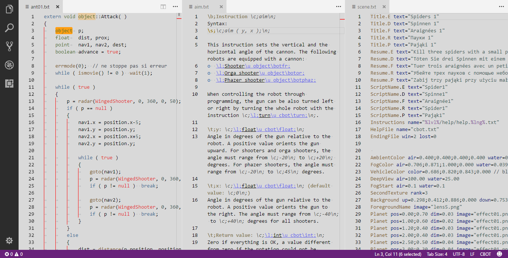
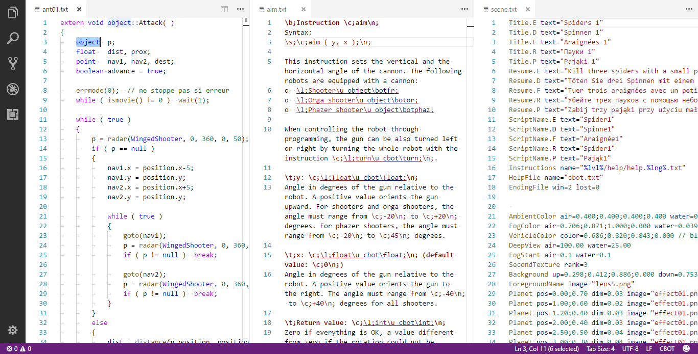
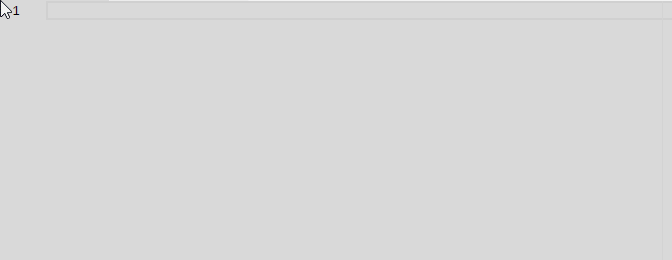

# colobot-extension

[VS Code](https://code.visualstudio.com/) extension for [Colobot](http://colobot.info/) developers and modders.

## Features

* Unique Colobot color theme
* Language grammars for:
    * CBOT source code
    * Colobot scene files
    * SatCom help files
* Language auto-detection based on unofficial (yet) file extensions (`cbot`, `satcom`, `scene`)
* ~~Language auto-detection based on first lines in `.txt` files.~~ (See [Known issues](#known-issues))
* Automatically set editor settings for CBOT and SatCom
* CBOT and SatCom snippets

## Screenshots

### Syntax Highlighting with Colobot Theme

### Syntax Highlighting with Dark+ Theme

### Syntax Highlighting with Light+ Theme

### Snippets for CBOT

### Snippets for SatCom

## Known Issues

### First line detection

The languages can't be detected automatically based on the first line in `.txt` file, as VS Code currently doesn't provide ability to do that (see [this issue](https://github.com/Microsoft/vscode/issues/10915)).

### Grammar not working well for certain color theme

The grammars were written mostly for the default Code themes and the Colobot theme. The syntax highlighting should be ok for most decent themes but may have some little issues like the same color for two different things (it may actually happen even in the default themes). Unfortunately, it's impossible to make it work perfectly for every color theme in the marketplace, but hopefully it's not that big of a problem.

## Release Notes

See [CHANGELOD.md](CHANGELOG.md).

## License

See [LICENSE.md](LICENSE.md).
