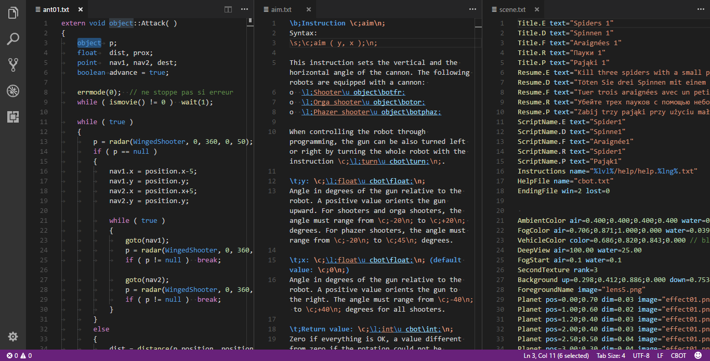

# colobot-extension

[VS Code](https://code.visualstudio.com/) extension for [Colobot](http://colobot.info) developers and modders.

## Features

* Syntax highlighting for:
    * CBOT source code
    * Colobot scene files
    * SatCom help files
* Language auto-detection based on unofficial (yet) file extensions (`cbot`, `satcom`, `scene`)
* ~~Language auto-detection based on first lines in `.txt` files.~~ (See [Known issues](#known-issues))
* Automatically set correct indentation settings for CBOT and SatCom.

## Known issues

The languages can't be detected automatically based on the first line in `.txt` file, as VS Code currently doesn't provide ability to do that (see [this issue](https://github.com/Microsoft/vscode/issues/10915)).

## Release Notes

See [CHANGELOD.md](CHANGELOG.md).

## License

See [LICENSE.md](LICENSE.md).

-----------------------------------------------------------------------------------------------------------

